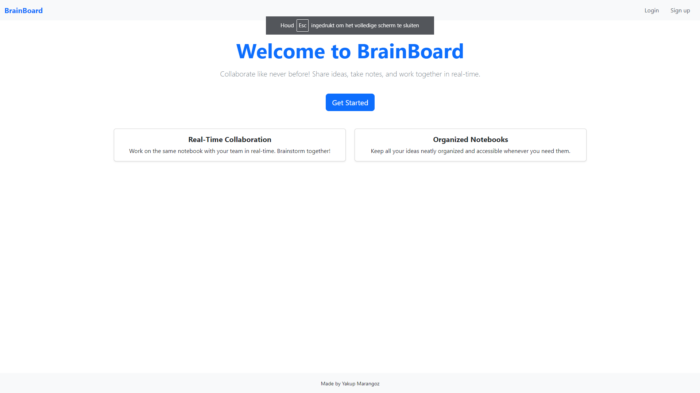
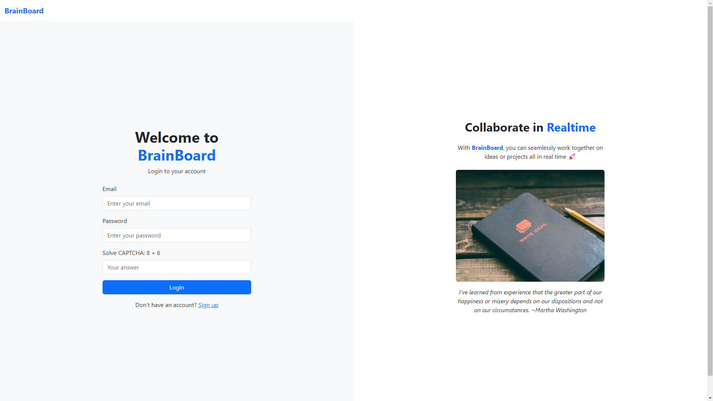
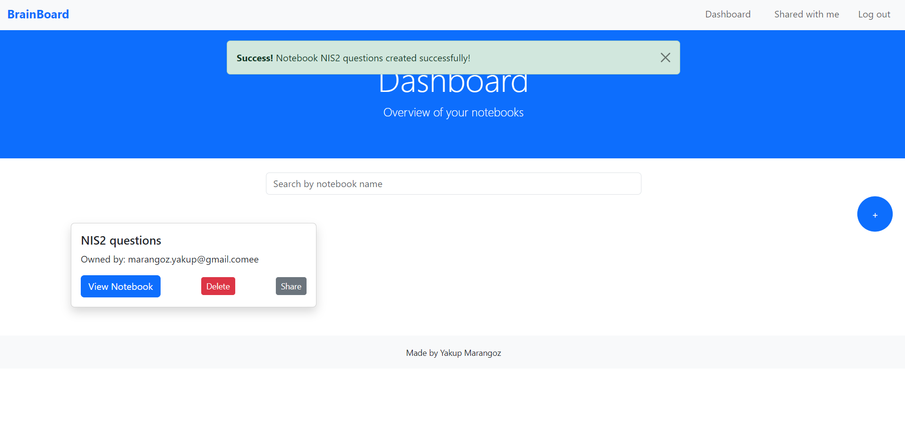
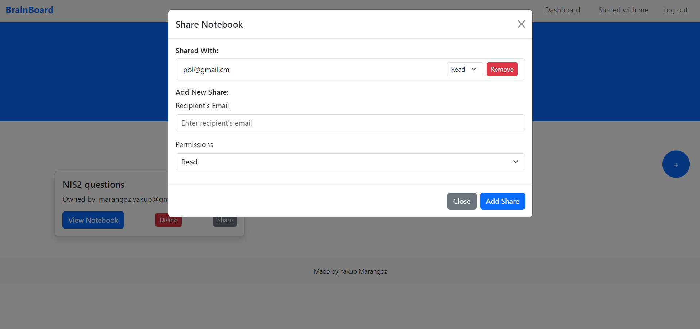
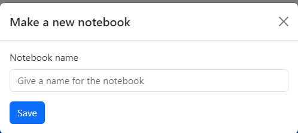
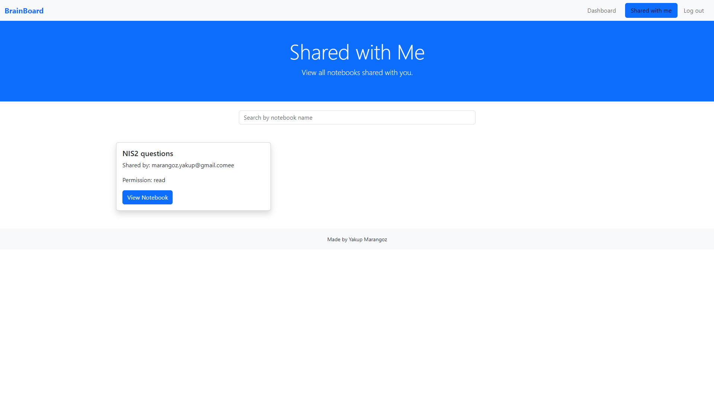
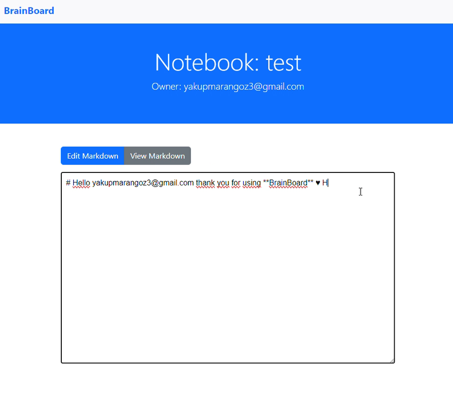

# BrainBoard

## Index Page

## Login Page

## Signup Page

## Dashboard

## Shared With Me

## Notebook Page

## Demo Data

#### Users
* **Username**: testuser@gmail.com
  * **Password**: Test12345.

* **Username**: testuser2@gmail.com
  * **Password**: Test12345.

#### Links
* **Youtube link**: https://www.youtube.com/watch?v=m34ZKJNyxac
* **Youtube link**: https://www.youtube.com/watch?v=3Njxv_D3MEQ
* **Youtube link**: https://www.youtube.com/watch?v=p_CvFgP4y-w
* **Image link**: https://i.imgur.com/bvYUuFD.jpeg
* **Image link**: https://i.imgur.com/btb0MX6.png
* **Image link**: https://i.imgur.com/vBTmzo9.jpeg

## Docker command
*docker build -t  brainboard .*

*docker run -p 8080:8080 brainboard*

*http://localhost:8080/*